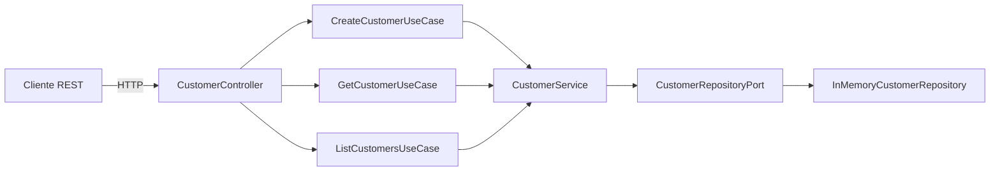

# Customer API

API REST para gestión de clientes construida con **Java 17**, **Spring Boot 4.1.0**, **Maven Wrapper**, persistencia en memoria y **arquitectura hexagonal**.

## Requisitos

- JDK 17 o superior
- No requiere Maven instalado globalmente (incluye Maven Wrapper)

## Ejecución

```powershell
.\mvnw.cmd spring-boot:run
```

URL base: `http://localhost:8080`

## Ejecución de pruebas

```powershell
.\mvnw.cmd clean test
```

Existen cinco suites de pruebas:

| Suite | Tipo | Tests | Qué verifica |
|---|---|---|---|
| `CustomerTest` | Unitario | 11 | Invariantes del dominio: validación de name y email, normalización, inmutabilidad de `withId` |
| `InMemoryCustomerRepositoryTest` | Unitario + Concurrencia | 12 | Guardado, consulta, listado, unicidad de email, seguridad thread-safe con lock |
| `CustomerServiceTest` | Unitario (Mockito) | 11 | Orquestación de casos de uso: delegación al repositorio, propagación de excepciones |
| `CustomerControllerTest` | Slice (MockMvc) | 16 | Mapeo HTTP, validación, estructura JSON de error con casos de uso mockeados |
| `CustomerApiIntegrationTest` | Integración | 11 | Stack real completo: controller → caso de uso → servicio → repositorio en memoria |

**Total: 62 pruebas**

## Endpoints

### `POST /customers`

Crea un nuevo cliente.

**Cuerpo de la solicitud**

```json
{
  "name": "Juan Perez",
  "email": "juan@email.com"
}
```

**Respuesta `201 Created`**

```json
{
  "id": 1,
  "name": "Juan Perez",
  "email": "juan@email.com"
}
```

**Cabeceras**
- `Location: /customers/1`

**Códigos HTTP**

| Código | Condición |
|---|---|
| 201 | Cliente creado |
| 400 | Error de validación (campos faltantes o inválidos) |
| 409 | Email ya existe (comparación case-insensitive luego de normalización) |

---

### `GET /customers/{id}`

Obtiene un cliente por su ID.

**Respuesta `200 OK`**

```json
{
  "id": 1,
  "name": "Juan Perez",
  "email": "juan@email.com"
}
```

**Códigos HTTP**

| Código | Condición |
|---|---|
| 200 | Cliente encontrado |
| 400 | Formato de ID inválido (ej. `/abc`) |
| 404 | Cliente no encontrado |

---

### `GET /customers`

Lista todos los clientes ordenados por ID ascendente.

**Respuesta `200 OK`**

```json
[
  {
    "id": 1,
    "name": "Ana",
    "email": "ana@email.com"
  },
  {
    "id": 2,
    "name": "Bob",
    "email": "bob@email.com"
  }
]
```

Retorna un arreglo vacío `[]` cuando no existen clientes.

## Ejemplos curl

```powershell
# Crear un cliente
curl -X POST http://localhost:8080/customers `
  -H "Content-Type: application/json" `
  -d "{"""name""":"""Juan Perez""","""email""":"""juan@email.com"""}"

# Consultar cliente por ID
curl http://localhost:8080/customers/1

# Listar todos los clientes
curl http://localhost:8080/customers

# Email duplicado (retorna 409)
curl -X POST http://localhost:8080/customers `
  -H "Content-Type: application/json" `
  -d "{"""name""":"""Otro""","""email""":"""juan@email.com"""}"

# Validación inválida (retorna 400)
curl -X POST http://localhost:8080/customers `
  -H "Content-Type: application/json" `
  -d "{"""name""":""","""email""":""""}"
```

## Arquitectura

El proyecto sigue **arquitectura hexagonal** (puertos y adaptadores).



**Capas**

| Capa | Paquete | Responsabilidad |
|---|---|---|
| **Dominio** | `domain/` | Reglas de negocio: `Customer` record con validación y normalización, `DuplicateEmailException` |
| **Aplicación** | `application/` | Interfaces de casos de uso (puertos de entrada), implementación del servicio, `CustomerNotFoundException` |
| **Infraestructura** | `infrastructure/` | Controlador REST (adaptador de entrada), DTOs, mapper, `GlobalExceptionHandler`, repositorio en memoria (adaptador de salida) |

**Regla de dependencia**: el dominio no tiene dependencias de Spring. La aplicación solo depende del dominio. La infraestructura conecta todo.

## Decisiones técnicas

| Decisión | Justificación |
|---|---|
| **Arquitectura hexagonal** | Aísla las reglas de negocio de los frameworks; los casos de uso son probables sin Spring; los adaptadores pueden intercambiarse (ej. memoria → PostgreSQL) sin modificar dominio ni aplicación |
| **Persistencia en memoria** | No requiere infraestructura externa para su evaluación; los datos son efímeros, acorde al alcance del ejercicio |
| **`ConcurrentHashMap`** | Mapa thread-safe sin sincronización explícita para operaciones de solo lectura (`findById`, `findAll`) |
| **`AtomicLong`** | Generación atómica de IDs sin locks en el camino común de lectura |
| **`ReentrantLock`** | Protege la sección crítica de `save()`: verificar unicidad de email, asignar ID y escribir en ambos mapas de forma atómica |
| **Dominio sin Spring** | `Customer` record es un POJO sin anotaciones; puede instanciarse en cualquier contexto |
| **DTOs** | Desacoplan el contrato HTTP del modelo de dominio; las anotaciones de validación (`@NotBlank`, `@Email`) viven en el DTO de solicitud sin contaminar el dominio |
| **Manejo centralizado de errores** | `@RestControllerAdvice` mapea cada excepción a una respuesta JSON consistente; los controllers se mantienen limpios |

## Thread safety

- **`findById`** / **`findAll`**: seguros para concurrencia via `ConcurrentHashMap` (sin locks explícitos, sin mutaciones)
- **`save`**: protegido por un `ReentrantLock`; la sección crítica verifica unicidad de email, genera un ID via `AtomicLong` y escribe en `customersById` y `emailIndex` de forma atómica — evitando emails duplicados y estados parciales entre los dos mapas
- **Pruebas de concurrencia**: `InMemoryCustomerRepositoryTest` incluye un escenario concurrente que lanza múltiples hilos para verificar que no se almacenen emails duplicados bajo carga paralela

## Respuestas de error

Todos los errores siguen una estructura JSON consistente:

```json
{
  "timestamp": "2026-07-28T22:50:00.000Z",
  "status": 404,
  "error": "Not Found",
  "message": "Customer not found with id: 99",
  "path": "/customers/99",
  "validationErrors": null
}
```

El campo `validationErrors` solo aparece en errores `400 Bad Request` por validación:

```json
{
  "timestamp": "2026-07-28T22:50:00.000Z",
  "status": 400,
  "error": "Bad Request",
  "message": "Validation failed",
  "path": "/customers",
  "validationErrors": [
    { "field": "name", "message": "must not be blank" }
  ]
}
```

**Códigos HTTP y mensajes de error**

| Código | Error | Mensaje |
|---|---|---|
| 400 | Bad Request | `"Validation failed"` (+ `validationErrors[]`) |
| 400 | Bad Request | `"Invalid parameter: {name}"` (tipo de dato incorrecto) |
| 404 | Not Found | `"Customer not found with id: {id}"` |
| 409 | Conflict | `"Email already exists: {email}"` |
| 500 | Internal Server Error | `"An unexpected error occurred"` |

## Estructura del proyecto

```
customer-api/
├── pom.xml
├── mvnw / mvnw.cmd
├── README.md
├── requests.http
├── src/
│   ├── main/
│   │   ├── java/com/pruebatecnica/customer/
│   │   │   ├── CustomerApiApplication.java
│   │   │   ├── domain/
│   │   │   │   ├── model/Customer.java
│   │   │   │   └── exception/DuplicateEmailException.java
│   │   │   ├── application/
│   │   │   │   ├── port/input/{Create,Get,List}CustomerUseCase.java
│   │   │   │   ├── port/output/CustomerRepositoryPort.java
│   │   │   │   ├── service/CustomerService.java
│   │   │   │   └── exception/CustomerNotFoundException.java
│   │   │   └── infrastructure/adapter/
│   │   │       ├── input/rest/
│   │   │       │   ├── CustomerController.java
│   │   │       │   ├── dto/{CreateCustomerRequest,CustomerResponse}.java
│   │   │       │   ├── mapper/CustomerMapper.java
│   │   │       │   └── advice/{GlobalExceptionHandler,ErrorResponse,ValidationError}.java
│   │   │       └── output/persistence/InMemoryCustomerRepository.java
│   │   └── resources/application.properties
│   └── test/java/com/pruebatecnica/customer/
│       ├── CustomerApiApplicationTests.java
│       ├── domain/model/CustomerTest.java
│       ├── application/service/CustomerServiceTest.java
│       └── infrastructure/adapter/
│           ├── input/rest/{CustomerControllerTest,CustomerApiIntegrationTest}.java
│           └── output/persistence/InMemoryCustomerRepositoryTest.java
```

## Mejoras futuras

Las siguientes están fuera del alcance actual y podrían abordarse en iteraciones posteriores:

- **Persistencia**: reemplazar el repositorio en memoria con PostgreSQL y migraciones Flyway/Liquibase
- **Observabilidad**: agregar health checks, métricas (Micrometer), logging estructurado y tracing distribuido
- **Seguridad**: agregar autenticación y autorización (Spring Security + JWT)
- **Documentación API**: generar OpenAPI / Swagger UI a partir de anotaciones
- **Pruebas de carga**: crear un plan de JMeter o Gatling
- **Contenedores**: imagen Docker y Docker Compose para desarrollo local
- **CI/CD**: pipeline de GitHub Actions o Jenkins para build, test y deploy automatizados
